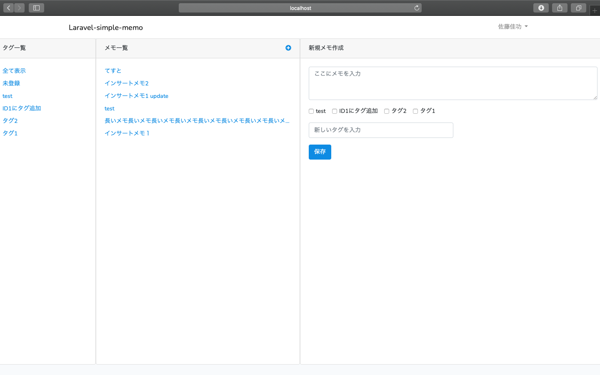
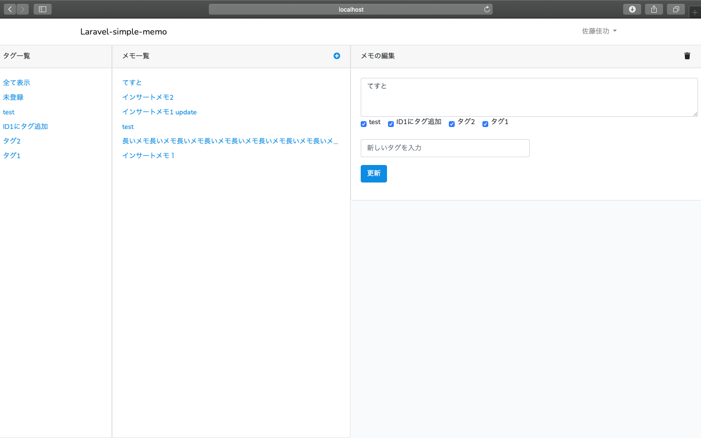

# laravel-simple-memo

laravelを使ってのメモアプリです。

## 簡単な説明

タグ一覧から登録したタグでメモの絞り込みができます。
メモ一覧から新規作成、既存メモの編集が可能です。

***デモ***

`
`

## 機能

## 必要要件

## 使い方

1. 「新規メモ作成」欄から新規メモ、新規タグを作成します。
2. メモ一覧からメモを編集します。
3. タグ一覧から対象のタグを押下すると対象のタグ名で登録したメモを絞り込みます。
 
## インストール

git clone https://github.com/yoshinori0811/laravel-simple-memo.git

-macの場合書き込み権限の変更が必要です-
・storage書き込み権限の変更
sudo chmod -R 0777 storage/

・bootstrap書き込み権の限変更
sudo chmod -R 0777 bootstrap/

## テスト

## デプロイ

## その他

## 作者

## ライセンス
